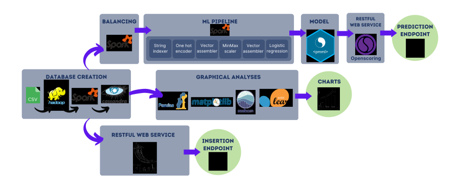

# HeartDiseasePrediction
## Description of the project
The project aims to:
- create a model for heart disease prediction starting with a [dataset](https://exploratory.io/data/YUi1hrv1vj/heart-2020-cleaned-kXz7WYW9NX)
- provide an endpoint for collecting more data to make the model increasingly accurate
- provide an endpoint for the prediction of heart disease
- create a graphical interface to
    - easily use the above endpoints
    - visualize via graphs the statistics regarding the processed data


## Prerequisites
Everything that follows can be installed via the script ```Server/0_install/0_installComponents.sh```
- Apache Hadoop 3.3.4
- Apache Spark 3.2.3 (newer versions are not supported by Pyspark2pmml)
- Cassandra (Cassandra 4.1, cqlsh 6.1.0)
- OpenScoring-server-jar 2.1.1
- Python libraries
    - pySpark
    - pyspark2pmml
    - flask
    - matplotlib
    - pandas
    - seaborn
    - scikit-learn
    - openscoring
    - flask
    - datetime
    - cassandra.cluster


## How does it works
The operation of the system can be analyzed through the flowchart below:


### Cassandra database creation
- Creates keyspace and table
- Uploads .csv file into hdfs
- Loads dataframe from hdfs with PySpark
- Pre-processes dataset by adding new 'id' column with PySpark
- Inserts PySPark dataframe into database

### Insertion endpoint
- Creates connection with Cassandra db with 'cassandra.cluster' lib
- Creates an app with Flask
- Exposes an endpoint for insertion in db accepting POST requests at 'http://127.0.0.1:5000/insert'
- Runs the app

### Prediction model creation
- Creates and starts an Openscoring instance
- Reads PySPark dataframe from Cassandra db
- Balances the dataframe by oversampling the 'No heart disease' dataframe portion and undersampling 'Heart disease' dataframe portion
- Creates a ML pipeline:
    - Indexes all categorical features producing -> indexed_categorical_features
    - Encodes all indexed_categorical_features producing -> encoded_categorical_features
    - Assembles all continuous fatures into a single column -> assembled_continuous_features
    - Normalizes newly assembled continuous features -> normalize_continuous_features
    - Assembles normalize_continuous_features with all encoded_categorical_features (exept the goal feature, aka 'heartdisease') into a single column producing -> final_features
    - Creates a logistic regression for 'heartdisease' based on final_features
- Splits the dataframe into 'train' (70%) and test (30%)
- Trains the model with the train dataframe
- Makes predictions with the test dataframe
- Estimates the accuracy of predictions with a MulticlassClassificationEvaluator
- Builds a PMML model with 'pyspark2pmml' lib
- Uploads the PMML model into Openscoring

### Graphical analyses
- By using matplotlib, pandas, seaborn and scikit-learn, creates the following charts:
    - HeatMap for correlation matrix with all features
    - HeatMap for the confusion matrix of the prediction model
    - Pie chart to visualize the distribution of responses for categorical features
    - Bar chart to visualize the distribution of heart diseases for each category of categorical features
    - Kernel density estimate plot to visualize the distribution of heart diseases, no heart diseases and total responses for continuous features

### Graphical user interface
Creates a web page that:
- Shows statistical graphs abount the dataset
- Shows the confusion matrix heatmap, to give an idea of the model accuracy
- Shows a form to make prediction, making requests to the prediction endpoint
- Gives the ability to enter the data just provided into the database, adding whether or not the subject has heart disease.


## Usage
### First installation
After installing the necessary components, you need to create a distributed database via Apache Cassandra with the script ```Server/0_install/1_createCassandraDb.sh```

### Starting server
To start the server, simply run the script ```Server/1_start_server/0_runServer.sh```

### Stopping server
IN order to stop the server, simply run the script ```Server/2_stop_server/stopServer.sh```

